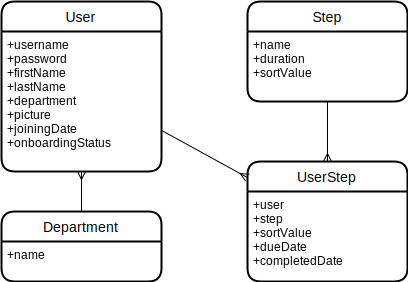
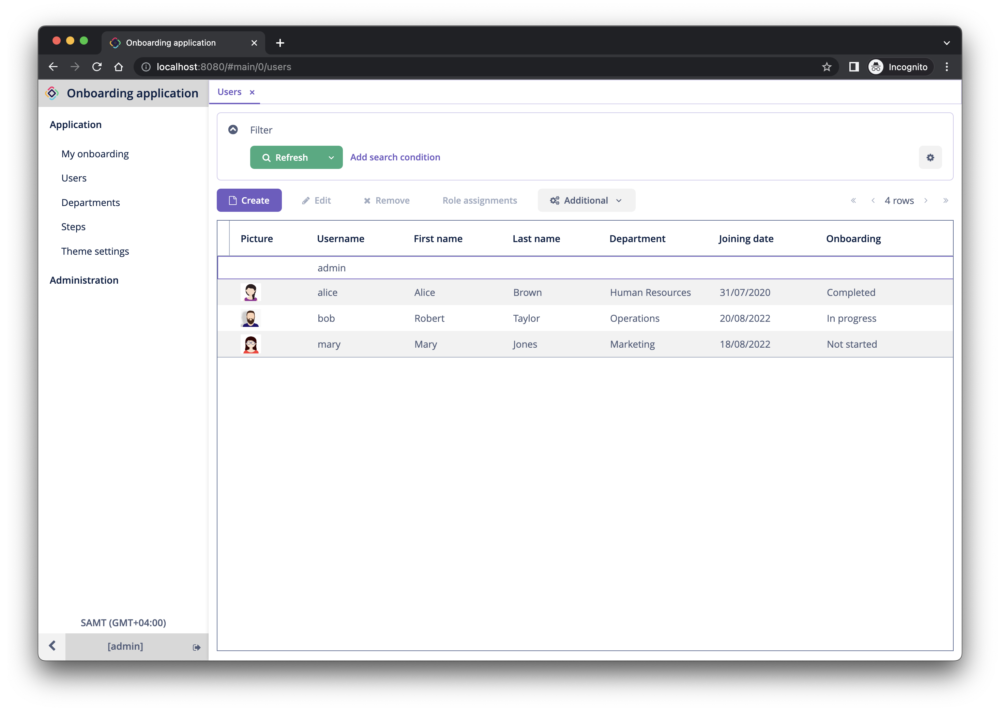
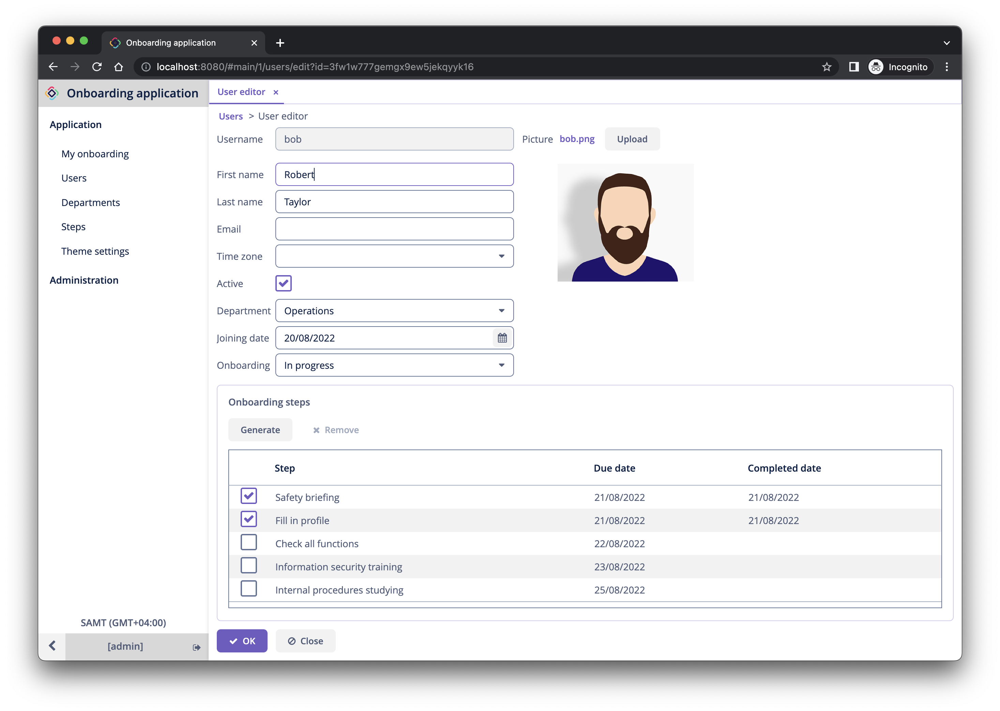
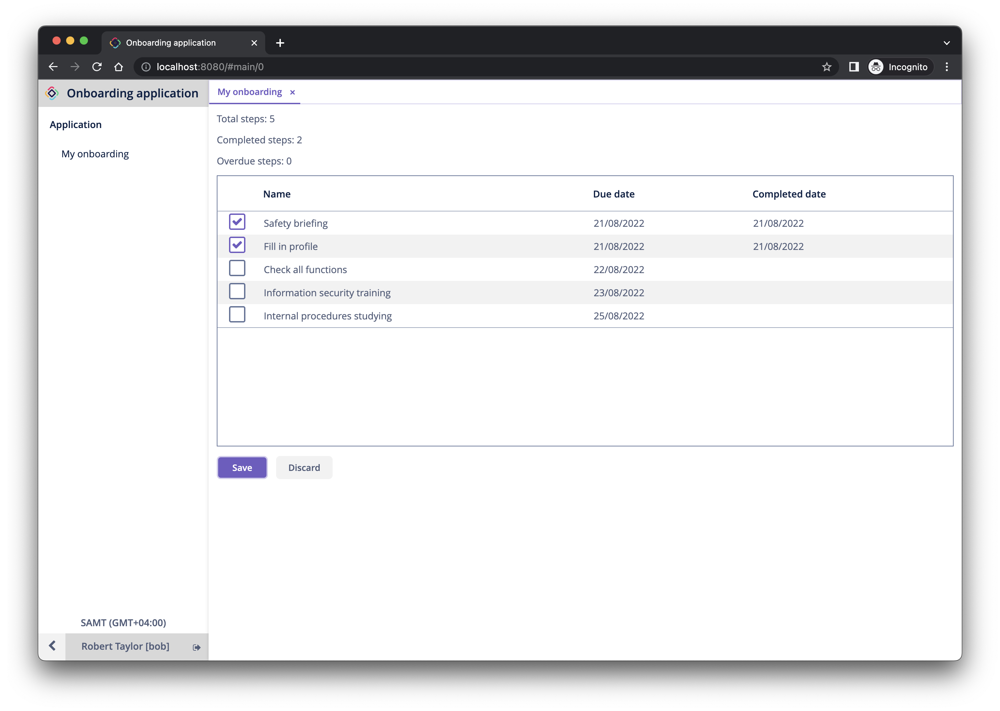

# Jmix Onboarding

This repository contains the complete source code of the example application built in Jmix Tutorial.

## Overview

The application is designed to automate the onboarding process for new employees. It contains the following entities and UI for them:

- User - the user of the application who is also an employee of the organization.
- Department - the organization department the user belongs to.
- Step - the onboarding step to complete for a new employee.
- UserStep - the onboarding step of a particular user.

### ER-diagram

### Administrator UI

### Employee UI

## How to run

1. Clone this repository
2. Open terminal in the project directory
3. Build and run the application: `./gradlew bootRun`
4. Open `http://localhost:8080` in a web browser
5. Login with `admin` user and `admin` password. Users `alice`, `bob`, `mary` have password `1`.